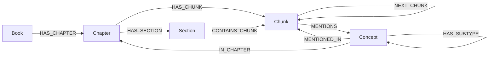

# MIS-Teach Knowledge Graph

This companion project builds an evidence-backed teaching-material knowledge graph and provides the optional GraphRAG API used by MIS-Teach Backend. It has two modes:

- **Mode A — Offline knowledge-graph construction:** authorised teaching material → chunks, concepts, verified relations, Neo4j import, and embeddings.
- **Mode B — Optional GraphRAG runtime API:** an imported Neo4j graph → FastAPI retrieval endpoints used by MIS-Teach Backend.

It is not a required service for basic quiz browsing. It is required when a deployment enables GraphRAG-backed tutoring or graph views. This repository contains no textbook, concept registry, Neo4j data, embedding, or generated graph output.

## Contents

- [Project role and inputs](#project-role-and-inputs)
- [Setup and environment variables](#setup-and-environment-variables)
- [Mode A — Offline knowledge-graph construction](#mode-a--offline-knowledge-graph-construction)
- [Graph schema and validation](#graph-schema-and-validation)
- [Mode B — GraphRAG runtime API](#mode-b--graphrag-runtime-api)
- [Backend integration and retrieval policy](#backend-integration-and-retrieval-policy)
- [Synthetic examples and verification](#synthetic-examples-and-verification)
- [Troubleshooting and limitations](#troubleshooting-and-limitations)

## Project role and inputs

| Item | Description |
| --- | --- |
| Input for Mode A | A locally supplied teaching-material PDF collection and matching global concept registry that you are authorised to process. |
| Output for Mode A | Per-chapter graph JSON, alignment and quality reports, then Neo4j nodes, relationships, vector indexes, and embeddings. |
| Input for Mode B | A reachable Neo4j database that already contains a validated imported graph and embeddings. |
| Output for Mode B | FastAPI JSON responses for vector seed retrieval, semantic scoring, concept locations, graph-aware retrieval, and status checks. |
| Runtime relationship | MIS-Teach Backend calls this service through `GRAPHRAG_API_BASE`; the Frontend never stores Neo4j or AI credentials. |

## Setup and environment variables

Windows PowerShell:

```powershell
git clone https://github.com/THEHAPPYMAN779991/MIS-Teach-Knowledge-Graph.git
Set-Location .\MIS-Teach-Knowledge-Graph
python -m venv .venv
.\.venv\Scripts\Activate.ps1
python -m pip install -r requirements.txt
Copy-Item .env.example .env
```

macOS / Linux Bash:

```bash
git clone https://github.com/THEHAPPYMAN779991/MIS-Teach-Knowledge-Graph.git
cd MIS-Teach-Knowledge-Graph
python3 -m venv .venv
source .venv/bin/activate
python -m pip install -r requirements.txt
cp .env.example .env
```

`.env` is local-only and ignored by Git. Use Vertex AI for the research reference configuration, or configure the retained AI Studio compatibility path.

| Variable | Required | Purpose | Safe example |
| --- | --- | --- | --- |
| `GEMINI_BACKEND` | AI graph build / embedding | `vertex` or `aistudio` backend selection | `vertex` |
| `VERTEX_PROJECT` or `GOOGLE_CLOUD_PROJECT` | Vertex AI | Google Cloud project identifier | `YOUR_PROJECT_ID` |
| `VERTEX_LOCATION` | Vertex AI | Vertex region | `us-central1` |
| `GEMINI_API_KEY` or compatible key variable | AI Studio only | Local AI Studio credential | leave blank until locally configured |
| `GEMINI_MODEL` | Optional | Generation model override | leave blank for source default |
| `GEMINI_EMBEDDING_MODEL` | Optional | Embedding model override | leave blank for source default |
| `NEO4J_URI` | Import, embed, API, query | Neo4j endpoint | `bolt://localhost:7687` |
| `NEO4J_USERNAME` / `NEO4J_PASSWORD` | Import, embed, API, query | Local Neo4j credentials | local-only values |
| `NEO4J_DATABASE` | Optional | Neo4j database name | `neo4j` |

## Mode A — Offline knowledge-graph construction

This is an offline preparation process. It is not started every time the Web application starts.

### Step 1 — Prepare authorised material

Create a local `BOOK/` directory containing your permitted chapter PDFs and a matching global concept registry. `BOOK/` is ignored deliberately. The builder checks PDF body headings against the registry; resolve missing registered sections before treating an output as a formal graph input.

### Step 2 — Build a chapter or a book

The public wrapper `scripts/build_book.py` invokes the current `build_book_from_global_registry` module. This example builds chapter 3; replace all identifiers with your own legal material and registry filename.

```powershell
python .\scripts\build_book.py `
  --book-dir .\BOOK `
  --global-registry .\BOOK\global_concept_registry.json `
  --chapters 3 `
  --output-dir .\outputs\build_ch03 `
  --chunk-size 2000 `
  --chunk-overlap 300 `
  --min-chunk-chars 500 `
  --max-chunk-chars 2400 `
  --coverage-target 0.90 `
  --stop-on-error
```

The build creates chapter JSON plus alignment, quality, checkpoint, and manifest reports under the chosen output directory. Generated outputs remain ignored.

### Step 3 — Validate before writing Neo4j

The builder validates its import contract before an ordinary build completes. You can additionally verify the Neo4j connection and perform a no-write import preflight:

```powershell
python .\scripts\check_neo4j.py
python .\scripts\ingest.py `
  --input .\outputs\build_ch03\ch03\ch03.json `
  --book-id demo_book `
  --book-title "Demo Book" `
  --chapter-id ch03 `
  --chapter-num 3 `
  --chapter-title "Demo Chapter" `
  --vector-dim 768 `
  --dry-run
```

`--dry-run` validates the supported import contract without Neo4j writes. Do not use an edited, stale, or failed-validation build as an import input.

### Step 4 — Import and create vector indexes

Remove `--dry-run` only after the preflight succeeds:

```powershell
python .\scripts\ingest.py `
  --input .\outputs\build_ch03\ch03\ch03.json `
  --book-id demo_book `
  --book-title "Demo Book" `
  --chapter-id ch03 `
  --chapter-num 3 `
  --chapter-title "Demo Chapter" `
  --vector-dim 768
```

### Step 5 — Generate embeddings

```powershell
python .\scripts\embed.py --chapter-id ch03 --targets both
```

The embedder accepts the short chapter identifier and resolves the importer-scoped chapter ID. A successful run reports the Concept and Chunk embeddings written to Neo4j.

### Step 6 — Verify retrieval

```powershell
python .\scripts\query.py `
  --query "Explain a sample concept" `
  --top-k 5 --top-m 5 --hops 1 --format json
```

This command requires the Neo4j graph and matching embeddings; it is not executable from the synthetic files alone.

## Graph schema and validation

The importer creates source-confirmed `Book`, `Chapter`, `Section`, `Chunk`, and `Concept` nodes. It links structural evidence with `HAS_CHAPTER`, `HAS_SECTION`, `HAS_CHUNK`, `CONTAINS_CHUNK`, `NEXT_CHUNK`, `IN_CHAPTER`, `MENTIONS`, and `MENTIONED_IN`.



The formal relation allow-list also includes source-confirmed types such as `PART_OF`, `IMPLEMENTS`, `USES`, `INVOKES`, `PROVIDES`, `MANAGES`, `ENABLES`, `CAUSES`, `EXAMPLE_OF`, `CONTRASTED_WITH`, `MAPS_TO`, `REPRESENTS`, `CONTAINS`, `CREATES`, `TRANSITIONS_TO`, `SAVES_TO`, `LOADS_FROM`, `RECLAIMS`, `WAITS_ON`, `SCHEDULES`, `INCREASES`, and `REDUCES`.

`PREREQUISITE_OF` is not accepted from ordinary per-chunk extraction alone. The importer admits it only from the separate verified pedagogical layer after evidence, confidence, cycle, and directness checks.

## Mode B — GraphRAG runtime API

This is an optional service in this same repository, not a separate repository. Start it only after Neo4j, the imported graph, and embeddings are ready:

```powershell
python .\scripts\serve_api.py
```

The current source starts Uvicorn on `http://127.0.0.1:8001`. Confirm availability without exposing credentials:

```powershell
Invoke-RestMethod http://127.0.0.1:8001/health
Invoke-RestMethod http://127.0.0.1:8001/stats
```

Useful source-confirmed endpoints include `POST /retrieve`, `POST /retrieve-seeds`, `POST /semantic-scores`, `GET /concept/{name}`, `GET /concept/{name}/locations`, `GET /books`, and `GET /stats`. `/retrieve` performs vector retrieval and graph expansion; `/retrieve-seeds` intentionally returns only vector-ranked seeds for controlled callers.

## Backend integration and retrieval policy

Set the Backend local environment variable:

```ini
GRAPHRAG_API_BASE=http://127.0.0.1:8001
```

MIS-Teach Backend owns the strict tutoring-context selection policy. For its current controlled GraphRAG path, the documented flow is:

```text
Question
  → vector-ranked Seed Concepts (Top 5)
  → each Seed contributes up to 3 direct Chunks ranked against the question
  → full-text deduplication
  → all distance-1 PREREQUISITE_OF candidates
  → semantic ranking and Top 5 prerequisite Concepts
  → only selected prerequisites contribute all direct Chunks
  → full-text deduplication and semantic Top 5 prerequisite Chunks
```

The API provides vector seeds and semantic scoring used by that policy; it does not make the Backend's tutoring prompt decisions. If the API or Neo4j credentials are unavailable, a deployment should disable GraphRAG or use an explicitly configured non-GraphRAG backend rather than embed credentials in source.

## Synthetic examples and verification

`examples/` contains invented concepts, chunks, relationships, and a query shape. They are documentation fixtures only, not an import-ready replacement for an authorised textbook registry.

```powershell
python -m unittest discover -s tests
python .\scripts\build_book.py --help
python .\scripts\ingest.py --help
python .\scripts\embed.py --help
python .\scripts\query.py --help
```

`serve_api.py` intentionally starts the API and does not provide a separate `--help` command. Use `python -m unittest discover -s tests -v` for a non-service verification; start the wrapper only when Neo4j and the required local environment variables are ready.

The unit test and remaining CLI-help commands do not require Neo4j, a textbook, or an AI request. Connection, build, import, embedding, and API retrieval checks require their external services and local configuration.

## Troubleshooting and limitations

| Symptom | Check |
| --- | --- |
| Builder reports unregistered PDF body headings | Add or correct matching concepts/sections in your local registry before a formal build. |
| Import refuses JSON | Inspect the build validation summary; the importer rejects unsupported schema, unresolved concepts, unapproved relations, or failed prerequisite checks. |
| No embeddings are written | Confirm Neo4j credentials, selected AI backend, and that the chapter ID resolves to imported data. |
| API cannot start or `/health` fails | Run `scripts/check_neo4j.py`, confirm dependencies, Neo4j availability, and local `.env` values. |
| Backend cannot retrieve GraphRAG evidence | Confirm this API is reachable at `GRAPHRAG_API_BASE`, then confirm the imported graph and vector indexes exist. |
| You only have synthetic examples | They demonstrate JSON shapes, not copyrighted teaching material or a complete import contract. Supply authorised material and registry data. |

## Related repositories

- [MIS-Teach Parent](https://github.com/THEHAPPYMAN779991/MIS-Teach)
- [MIS-Teach Backend](https://github.com/THEHAPPYMAN779991/MIS-Teach-Backend)
- [MIS-Teach Frontend](https://github.com/THEHAPPYMAN779991/MIS-Teach-Frontend)
- [MIS-Teach Exam Transcription](https://github.com/THEHAPPYMAN779991/MIS-Teach-Exam-Transcription)

## License

Formal licensing terms are pending an owner decision before public release. See the Parent repository's `LICENSE_DECISION_REQUIRED.md`.
